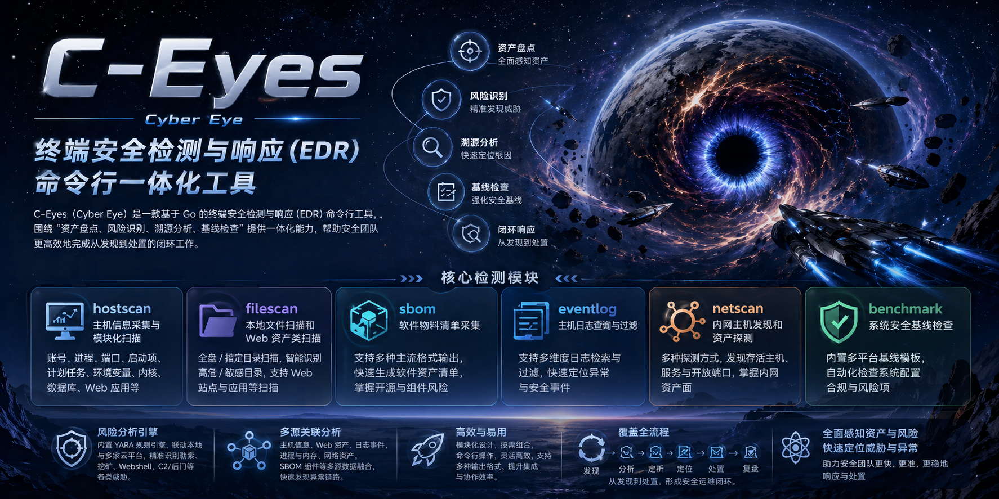

# C-Eyes 工具简介

C-Eyes（Cyber Eye）是一款基于 Go 的终端安全检测与响应（EDR）命令行工具，围绕“资产盘点、风险识别、溯源分析、基线检查”提供一体化能力：可进行主机与文件信息采集、异常与风险分析、主机日志检索、内网资产探测、SBOM 软件物料清单生成、安全基线检查，帮助安全团队更高效地完成从发现到处置的闭环工作。 



## 模块简介
- `hostscan` 模块: 主机信息采集与模块化扫描（账号、进程、端口、启动项、计划任务、环境变量、内核、数据库、Web 应用等）
- `filescan` 模块: 本地文件扫描和 Web 资产类扫描
- `sbom` 模块: 软件物料清单采集
- `eventlog` 模块: 主机日志查询与过滤
- `netscan` 模块: 内网主机发现和资产探测
- `benchmark` 模块: 安全基线检查
```
C-Eyes工具基于上述检测模块扫描信息，提供基于yara规则风险分析的能力，当前hostscan和filescan已完成入侵风险分析的对接，在一级指令后添加 --riskanalyze或者-r与风险分析进行联动。
```

## 安装说明
直接下载编译好的zip压缩包，为保证检测覆盖范围和效果，建议使用高权限用户启动。

Windows 操作系统：建议以管理员身份运行 cmd，之后再输入 C-Eyes 路径运行即可或进入终端后切换到 C-Eyes 程序目录下运行程序。
```
c-eyes -h         #如果显示帮助信息说明安装成功
```

Linux 操作系统：建议以 root 用户身份运行 C-Eyes 工具。
```
./c-eyes -h       #如果显示帮助信息说明安装成功
```

## 云平台配置说明
建议分析少量目标时使用（云平台本身会有限流和限量），不配置api-key会自动跳过云平台分析，除纯云平台分析外其它模式均可正常使用。可执行文件同目录放置 `c-eyes-cloud.json` 文件，直接打开配置api-key即可。

`c-eyes` 的风险分析支持联网云平台分析，当前支持以下平台：
- `virustotal`
- `hybrid_analysis`
- `malwarebazaar`
- `otx`
- `triage`


## 主要操作说明
### 资产与信息采集
主机信息获取: `c-eyes hostscan --all`

Web文件信息获取：`c-eyes filescan --all`

指定目录信息获取： `c-eyes filescan --scan-mode path <path>`

指定目录智能信息获取(只获取高危/敏感目录)： `c-eyes filescan --scan-mode path <path> --smart`

主机日志信息获取： `c-eyes eventlog`  

内网主机探测： `c-eyes netscan`

可访问网段探测： `c-eyes netscan -reachablesegments`

软件物料清单采集：`c-eyes sbom -p <app-path>`

镜像物料清单采集：`c-eyes sbom --image-target <value>`  ，支持镜像引用（如 `nginx:1.27`）、镜像归档文件（如 `D:\images\nginx.tar`）和 OCI layout 目录（如 `D:\images\nginx-oci`），

### 风险分析
主机异常分析： `c-eyes hostscan --all -r`

Web文件异常分析: `c-eyes filescan --all -r`

指定目录异常分析： `c-eyes filescan --scan-mode path <path> -r`

指定目录智能分析(只分析高危/敏感目录)： `c-eyes filescan --scan-mode path <path> -r --smart`

指定分析源异常分析： `c-eyes-r -input/-file/-dir/-pid/-pname`   (必须指定分析源，参数五选一)

    -input <scan.json/scan.csv/scan.xlsx>    指定已有扫描结果文件路径当作分析源
    -file <path>                             指定单独文件路径当作分析源
    -dir  <path>                             指定目录路径当作分析源，按目录下文件做风险分析
    -pid  <pid>                              指定进程 PID 当作分析源
    -pname  <process_name>                   指定进程名当作分析源
  
### 安全基线检查
安全基线检查： `c-eyes benchmark`   
```
--baseline-level <level>         基线等级: 1|2|3|4 (默认: 1)
```
目前支持 Windows，Linux，银河麒麟，EulerOS 四种系统（默认根据系统自动选择模板），每个系统支持 1/2/3/4 四个级别的基线等级检查（默认使用 1 级），需要使用管理员权限运行


## 详细操作说明

### 主机扫描(hostsacn)
```
主机异常分析： c-eyes hostscan --all -r
主机信息获取:  c-eyes hostscan --all
支持六种模块的分析：
    process              进程模块
    startup              启动项模块
    scheduledtask        定时任务模块
    kernel               内核模块
    database             数据库模块
    application          Web应用模块
支持所有模块(十种)的信息获取：
    account              账号模块
    usergroup            用户组模块
    process              进程模块
    port                 端口模块
    startup              启动项模块
    scheduledtask        定时任务模块
    environment          环境变量模块
    kernel               内核模块           
    database             数据库模块
    application          Web应用模块
参数：
    --all                                    启用所有模块
    --custom <mode1>,<mode2>,...,<moden>     启用指定模块
异常分析相关参数(启用-r以后支持)：
    -yara-rules <path>                       yara规则路径
    -analysis-max-duration <number(s/m/h)>   分析时长限制(要加上单位，比如30s,5m,1h)
    -process-memory                          启用采集进程内存样本(仅当使用 process 模块时支持)
说明：
    单模块/多模块扫描的请求过滤参数可以单独通过 ./c-eyes hostscan --custom <mode> -h 查看

```

### 文件扫描(filescan)
```
本地文件异常分析： c-eyes filescan --scan-mode <mode> -r
本地文件信息获取： c-eyes filescan --scan-mode <mode>
扫描模式选择<mode>：
    full              全盘扫描
    path <path>       指定目录扫描
参数：
    --max-targets <number>      参数限制扫描目标数量
    --smart                     启用智能扫描，在full/path限定的范围内扫描高危/敏感目录
异常分析相关参数(启用-r以后支持)：
    -yara-rules <path>                       yara规则路径
    -analysis-max-duration <number(s/m/h)>   分析时长限制(要加上单位，比如30s,5m,1h)
    -cloud-upload                            启用文件上传云分析
    --risk-mode <mode>                       风险分析模式
        mode: local_only / cloud_only  / fast / smart / deep
说明：
    --scan-mode，--all，--custom 参数互斥不能同时使用
    风险分析模式名称详解：local_only(本地分析模式) ，cloud_only (云分析模式) ，fast(快速分析模式) ，smart(智能分析模式)， deep(深度分析模式)
```
```
Web文件异常分析: c-eyes filescan --all -r
Web文件信息获取：c-eyes filescan --all
支持三种模块的信息获取/分析：
    site                 Web站点模块
    framework            Web框架模块
    jarpackage           Jar包模块
    software             软件应用模块
参数：
    --all                                   启用所有模块
    --custom <mode1>,<mode2>,...,<moden>    启用指定模块
异常分析相关参数(启用-r以后支持)：
    -yara-rules <path>                       yara规则路径
    -analysis-max-duration <number(s/m/h)>   分析时长限制(要加上单位，比如30s,5m,1h)
    -cloud-upload                            启用文件上传云分析
    --risk-mode <mode>                       风险分析模式
        mode: local_only / cloud_only  / fast / smart / deep
说明：
    单模块/多模块扫描的请求过滤参数可以单独通过 ./c-eyes filescan --custom <mode> -h 查看
    风险分析模式名称详解：local_only(本地分析模式) ，cloud_only (云分析模式) ，fast(快速分析模式) ，smart(智能分析模式)， deep(深度分析模式)
```

### 日志扫描(eventlog)
```
主机日志信息获取： c-eyes eventlog  (默认导出24h内的)
常用过滤参数：
    -last <number>                查询最近多长时间段的日志(格式是时间段不是纯数字例如：30m、1h、24h、7d)
    -start-time <timestamp>       查询开始时间(格式：YYYY-MM-DD HH:MM:SS/YYYY-MM-DD HH:MM/YYYY-MM-DD)
    -end-time <timestamp>         查询结束时间(格式：YYYY-MM-DD HH:MM:SS/YYYY-MM-DD HH:MM/YYYY-MM-DD)
    -eventTypes <eventType1,eventType2,...>     查询指定事件类型日志
    -eventLevels <level1,level2,...>            查询指定事件级别日志
    -keyword <text>                             查询指定关键字日志
```

### 内网主机探测(netscan)
```
内网主机探测： c-eyes netscan   (默认ARP扫描主网卡C段)
常用参数：
    -target <expr>                          指定扫描目标（支持 IP/CIDR/IPv4 范围/列表，逗号分隔，如： 192.168.1.0/24、fe80::/64、192.168.1.10,192.168.1.20）
    -targetFile <path>                      指定目标文件（UTF-8；每行一个目标；支持 # 注释）
    -scanMode <m1,m2,...>                   探测模式：A,ICP,ICA,ICT,T,TS,U,N,O,默认：A
    -ipv6                                   启用 IPv6 探测（仅对支持 IPv6 的模式生效）
    -exclude <expr>                         排除目标（优先级高于 -target/-targetFile）
    -maxTargets <number>                    最大目标数安全阈值（超限拒绝执行）
    -reachableSegments                      开启路由可达网段发现与验证(默认关闭，该模式下支持的常用参数包括target,targetFile,scanMode,exclude,maxTargets，该模式下启用的默认值和netscan主模式的默认值不同)
说明：
    ICP/ICA/ICT 可能需要管理员权限（raw ICMP）。
    TS 在当前实现中会回退为 TCP connect，输出会在 warnings/sources 中明确标注。
    探测模式名称详解：A(ARP)，ICP(ICMP-PING)，ICA(ICMP-ADDRESSMASK)，ICT(ICMP-TIMESTAMP)，T(TCP-CONNECT)，TS(TCP-SYN)，U(UDP)，N(NETBIOS)，O(OXID)。
```


### 物料清单采集(sbom)
```
软件物料清单采集：c-eyes sbom -p <app-path>
镜像物料清单采集：c-eyes sbom --image-target <value>
参数：
    -p, --path <app-path>                指定扫描根路径（必填）
    --image-target <value>               指定镜像采集目标
    --target-type <type>                 指定镜像采集目标类型: auto|image|archive|oci-layout (默认: auto)
    --format <xspdx-json|spdx-json>      指定 SBOM 输出内容格式（默认：xspdx-json）
说明：
    -p/--path 与 --image-target 互斥，二者必须且只能选择一种
    --target-type 仅可与 --image-target 一起使用，不能与 -p/--path 同时使用
    --image-target 在未显式指定 --target-type 时默认使用 auto 自动识别
        image ：表示镜像引用（如 nginx:1.27），
        archive ：表示本地镜像归档文件（如 D:\images\nginx.tar），
        oci-layout ：表示本地 OCI Image Layout 目录（如 D:\images\nginx-oci）
    不指定 -o 时，自动按 result.json、result1.json、resultN.json 递增输出
```

### 安全基线检查(benchmark)
```
安全基线检查： c-eyes benchmark
参数：
    --template <name>                模板选择: auto|windows|linux|euleros|kylin (默认: auto)
    --baseline-level <level>         基线等级: 1|2|3|4 (默认: 1)
说明：
    模板名称详解：auto(自动选择)，windows(Windows系统)，linux(Linux系统)，euleros(EulerOS系统)，kylin(银河麒麟)
    必须使用管理员权限运行
```

### 指定分析源分析
```
指定分析源进行异常分析： c-eyes -r -input/-file/-dir/-pid/-pname (必须指定分析源，参数五选一)
参数：
    -yara-rules <path>                       yara规则路径
    -analysis-max-duration <number(s/m/h)>   分析时长限制(要加上单位，比如30s,5m,1h)
    --risk-mode <mode>                       风险分析模式
        mode: local_only / cloud_only  / fast / smart / deep
    -cloud-upload                            启用文件上传云分析
    -process-memory                          启用采集进程内存样本
    -input <scan.json/scan.csv/scan.xlsx>    指定已有扫描结果文件路径当作分析源
    -file <path>                             指定单独文件路径当作分析源
    -dir  <path>                             指定目录路径当作分析源，按目录下文件做风险分析
    -pid  <pid>                              指定进程 PID 当作分析源
    -pname  <process_name>                   指定进程名当作分析源
说明：
    --scan-mode，--all，--custom 参数互斥不能同时使用
    风险分析模式名称详解：local_only(本地分析模式) ，cloud_only (云分析模式) ，fast(快速分析模式) ，smart(智能分析模式)， deep(深度分析模式)
```


### 全局输出设置
```          
  -o, --output <path>      输出路径（根据后缀识别 .json/.csv/.xlsx），默认(不启用-o)时在当前目录下输出 result*.xlsx 文件
  注意：sbom 模式仅接受 .json 输出后缀，默认输出到当前目录：result*.json ，默认内容格式：xspdx-json，兼容 spdx-json 导出
```

## 注意事项
在 C-Eyes 工具目录下子目录 yaraRules 中，部分规则会触发杀毒软件告警，因为该目录存放的规则文件与杀软查杀规则相符，会触发杀软告警，直接加白即可，不会存在实际危害。

## 归属
M-SEC 社区 ：https://msec.nsfocus.com

## 附录：目前支持的检测规则
目前支持的恶意样本检测重点覆盖勒索、挖矿、僵尸网络、Webshell、C2/后门及银狐等方向，适用于hvv场景。

### 勒索：
Babuk、BadEncript、BadRabbit、BCrypt、BlackMatter、Cerber、Chaos、ChupaCabra、Common、Conti、Cryakl、CryptoLocker、cryt0y、DarkSide、Fonix、GandCrab、Globeimposter、Henry217、HiddenTear、House、LockBit、Locky、Magniber、Makop、MBRLocker、MedusaLocker、Nemty、NoCry、Petya、Phobos、Povlsomware、QNAPCrypt、Sarbloh、Satana、ScreenLocker、Sodinokibi、Stop、Termite、TeslaCrypt、Thanos、Tohnichi、TrumpLocker、Venus、VoidCrypt、Wannacrypt、WannaDie、WannaRen、Zeppelin。

### 挖矿：
Wannamine、ELFcoinminer、givemexyz 家族、Monero、TrojanCoinMiner。

### 僵尸网络：
BlackMoon、Festi、Gafgyt、Kelihos、Mykings。

### Webshell 及蓝军武器：
支持中国菜刀、Cknife、Weevely、蚁剑 antSword、冰蝎 Behinder、哥斯拉 Godzilla 等常见工具的 webshell 脚本检测，同时覆盖 ChinaChopper、ASPXSpy、Laudanum、WebShellTerminal、WebShellsMicro、CobaltWebshell、BurrowShell 等常见变种与落地样本特征。

### 银狐：
已内置银狐专项检测规则（SilverFox.yara），用于识别 SilverFox 家族典型样本特征；同时在部分加载器/工具链相关规则中包含银狐关联特征，用于提升银狐攻击链检出能力。

### C2 远控与后门：
覆盖 Cobalt Strike（Beacon/Loader/Packer/Shellcode 等）、Empire/PowEmpire、Metasploit、Meterpreter、Sliver、Viper、DonutLoader、FossilBeacon、APT_Cobalt、Agent 等攻防常见工具链。

### 其他恶意工具补充：
Malicious.tools、Malware.FiveSys、Malware.Mikey、Malware.Rekoobe。
